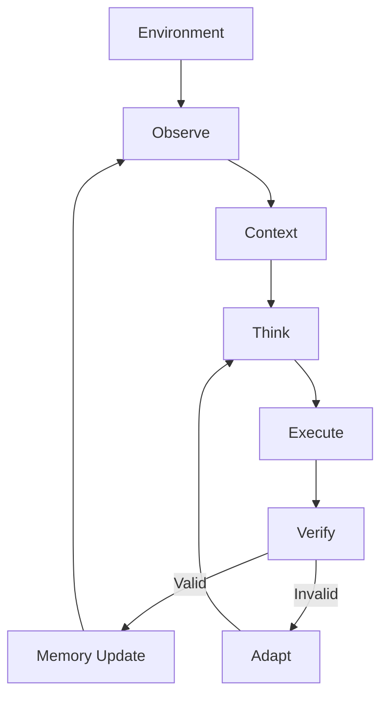

# SEAL Architecture

## Self Executing Agent Loop

The core idea is simple:

> the system can continue operating without requiring a new human prompt for every cycle.

---

## High-Level Flow



---

## 1. Observe

The agent reads the current state.

Examples:

- new data
- tool output
- memory
- external events
- previous execution result
- current objective

```python
state = observe()
```

---

## 2. Think

The agent determines the next action from the current context.

```python
plan = think(state)
```

This can include:

- selecting a tool
- decomposing a task
- choosing a strategy
- prioritizing actions
- deciding whether to continue

---

## 3. Execute

The selected action changes the environment.

```python
result = execute(plan)
```

The result becomes new information.

---

## 4. Verify

The agent checks whether the action actually worked.

```python
valid = verify(result)
```

A loop without verification is just repeated execution.

---

## 5. Adapt

If the action fails, the strategy changes.

```python
if not valid:
    adapt()
```

Failure is not necessarily the end of the loop.

It is new context.

---

## 6. Memory

Successful and failed cycles can both update memory.

```python
memory.update({
    "state": state,
    "plan": plan,
    "result": result,
    "verified": valid,
})
```

The next cycle starts with more context than the previous one.

---

## Runtime Model

```text
┌───────────────────────────────┐
│           ENVIRONMENT         │
└───────────────┬───────────────┘
                ↓
        ┌───────────────┐
        │    OBSERVE    │
        └───────┬───────┘
                ↓
        ┌───────────────┐
        │    CONTEXT    │
        └───────┬───────┘
                ↓
        ┌───────────────┐
        │     THINK     │
        └───────┬───────┘
                ↓
        ┌───────────────┐
        │    EXECUTE    │
        └───────┬───────┘
                ↓
        ┌───────────────┐
        │    VERIFY     │
        └───────┬───────┘
                ↓
        ┌───────────────┐
        │ UPDATE MEMORY │
        └───────┬───────┘
                │
                └──────────────↺
```

---

## The primitive

```text
STATE
  ↓
ACTION
  ↓
RESULT
  ↓
VERIFICATION
  ↓
NEW STATE
  ↺
```

That is the entire idea behind `$SEAL`.
