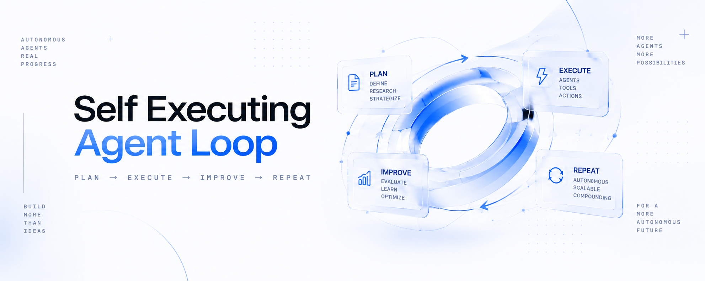
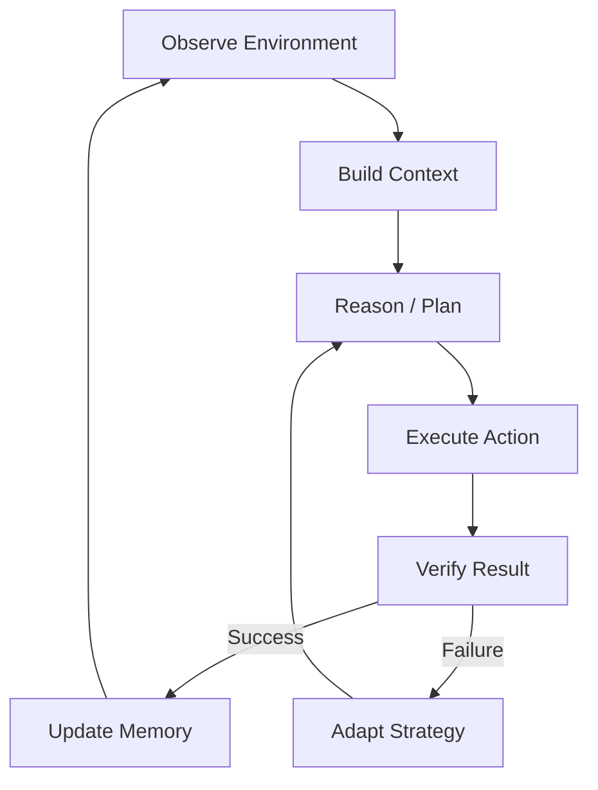

<div align="center">



<br>


# Self Executing Agent Loop

**Observe → Think → Execute → Verify → Repeat**

An autonomous agent that does not wait for the next prompt.

It runs the loop.

[](https://x.com/0xRicker)


</div>

---

## What is Self Executing Agent Loop?

The first generation of AI waited for a prompt.

The next generation keeps going.

A Self Executing Agent Loop:

```text
OBSERVE
   ↓
THINK
   ↓
EXECUTE
   ↓
VERIFY
   ↓
UPDATE CONTEXT
   ↓
REPEAT
   ↺
```

The output of one cycle becomes the context for the next.

The loop does not ask:

> What should I do next?

It asks:

> What does the current state require?

---

## The Core Loop

```python
while True:
    context = observe()
    plan = think(context)
    result = execute(plan)

    if verify(result):
        update_context(result)
    else:
        adapt()

    repeat()
```

---

## Agent Runtime

```text
[00:00:01] OBSERVE   environment state loaded
[00:00:02] THINK     next action selected
[00:00:03] EXECUTE   action completed
[00:00:04] VERIFY    result validated
[00:00:05] MEMORY    context updated
[00:00:06] LOOP      next cycle started
[00:00:07] LOOP      next cycle started
[00:00:08] LOOP      next cycle started
...
```

**No second prompt required.**

---

## Architecture



More detail: [ARCHITECTURE.md](./ARCHITECTURE.md)

---

## Project Status

| Field | Value |
|---|---|
| Project | Self Executing Agent Loop |
| Contract | `TBA` |
| Chain | `TBA` |
| Launch | `TBA` |
| X | [@0xRicker](https://x.com/0xRicker) |

> Contract address will be added after launch.

---

## The Manifesto

```text
PROMPTS ARE MANUAL.

LOOPS ARE AUTONOMOUS.

OBSERVE.
THINK.
EXECUTE.
VERIFY.
REMEMBER.
REPEAT.

DON'T WAIT FOR THE NEXT PROMPT.
BECOME THE NEXT PROMPT.
```

---

## Loop Principles

1. **State over prompts**  
   The system reacts to the current environment, not only to manual input.

2. **Execution over conversation**  
   The point of the loop is action.

3. **Verification over assumption**  
   Every action produces a result that must be checked.

4. **Memory over reset**  
   Every cycle can improve the context of the next cycle.

5. **Iteration over completion**  
   The end of one cycle is the start of another.

---

## Roadmap

```text
PHASE 01  [✓] DEFINE THE LOOP
PHASE 02  [✓] BUILD THE INITIAL SYSTEM
PHASE 03  [ ] EXPAND THE ARCHITECTURE
PHASE 04  [ ] START THE PUBLIC LOOP
PHASE 05  [ ] KEEP ITERATING
```

---

## Repository Structure

```text
Self-Executing-Agent-Loop/
├── assets/
│   ├── banner.png
│   └── logo.png
├── README.md
├── ARCHITECTURE.md
├── lore.md
├── loop.py
├── LICENSE
└── .gitignore
```

---

## Links

- **X:** [@0xRicker](https://x.com/0xRicker)
- **Contract:** `TBA`
- **Website:** `TBA`

---

## Disclaimer

Self Executing Agent Loop is an experimental project inspired by autonomous agent architectures.

Nothing in this repository is financial advice, a promise of returns, or a guarantee of future value, functionality, or utility.

---

<div align="center">

### THE LOOP IS ALREADY RUNNING.

`OBSERVE → THINK → EXECUTE → VERIFY → REPEAT`

</div>
